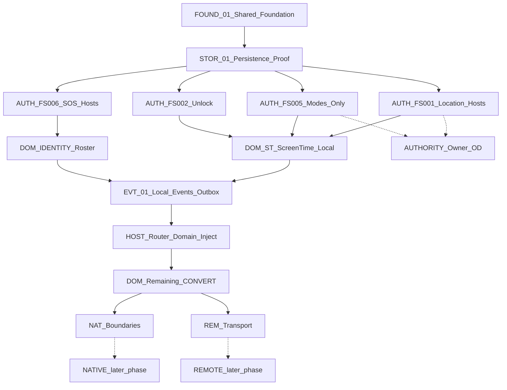

# PHASE 1.75 — MIGRATION GRAPH

**Companion to:** `PHASE_1_75_MOCK_TO_REAL_AUDIT.md`  
**Date:** 2026-09-24  
**Mode:** READ-ONLY documentation  
**WILL MODIFY PRODUCTION CODE:** NO  
**PHASE 1.75 CODEGEN:** NOT YET ARMED

Lane tags: **LOCAL** · **NATIVE** · **REMOTE** · **AUTHORITY**



---

## Node catalog

### FOUND-01 — Shared Foundation Honesty

| Field | Value |
|-------|-------|
| ID | `FOUND-01` |
| Lane | LOCAL |
| Current State | `FsSessionKernel` opens with `preferSqlite: true`; schema v10; CapabilityRegistry seeded; Memory fallback on open failure |
| Target State | Same architecture; fallback observable to operators/tests; no fake “always SQLite” claim |
| Dependency | None |
| Blocker | None for documentation; implementation must not change ownership model |
| Evidence | `app/lib/main.dart`, `fs_session_kernel.dart`, `local_database.dart`, `capability_registry.dart` |
| Safe to migrate now? | **YES** (observability / tests only — still requires Owner arming) |

### STOR-01 — SQLite Restart Proof

| Field | Value |
|-------|-------|
| ID | `STOR-01` |
| Lane | LOCAL |
| Current State | Disk path implemented; reopen persistence **unproven** |
| Target State | Automated write→close→reopen assertions for FS Local*Stores |
| Dependency | FOUND-01 |
| Blocker | Test harness only; do not claim offline-resilient until green |
| Evidence | `phase15_hardening_test.dart` migrates schema but does not prove product data reopen |
| Safe to migrate now? | **YES** (test evidence slice) |

### AUTH-FS001 — Location Host Bind

| Field | Value |
|-------|-------|
| ID | `AUTH-FS001` |
| Lane | AUTHORITY + LOCAL |
| Current State | Domain stores exist; FAT-015/016/017 default Stage-1 InMemory |
| Target State | Production routes use `DomainSafeZonesRepository` / `DomainLocationHistoryRepository`; Stage-1 → LEGACY_REMOVE |
| Dependency | STOR-01 recommended; Owner OD-B |
| Blocker | AUTHORITY — dual default; GPS remains NOT_IMPLEMENTED (do not “fix” with fake GPS) |
| Evidence | `safe_zones_screen.dart`, `location_history_screen.dart`, `location_ux_bridge.dart`, Integrity C-02 |
| Safe to migrate now? | **YES after OD-B** (bind only; no native GPS) |

### AUTH-FS005 — Modes-Only Path

| Field | Value |
|-------|-------|
| ID | `AUTH-FS005` |
| Lane | AUTHORITY + LOCAL |
| Current State | FAT-085 Modes then Prefs fallback; CHD-004 disclosure unbound |
| Target State | ModesService only in production; Prefs Smart Modes test-only → G; CHD-004 receives ModesEvaluation |
| Dependency | FOUND-01; Owner OD-C; OD-D ScheduleWindow stays ST |
| Blocker | AUTHORITY dual path; OS wake remains MOCK-REMOTE |
| Evidence | `smart_modes_screen.dart`, `modes_engine.dart`, `child_day_board_screen.dart` |
| Safe to migrate now? | **YES after OD-C** |

### AUTH-FS006 — SOS Host → sos_final

| Field | Value |
|-------|-------|
| ID | `AUTH-FS006` |
| Lane | AUTHORITY + LOCAL |
| Current State | `LocalSosFinalStore` SQLite v9 exists; n10 hosts use Stage-1 SOS repos |
| Target State | Emergency screens bind `Stage1SosFinalRuntime`; Stage-1 alert path → G |
| Dependency | FOUND-01; location honesty bridge already coded |
| Blocker | AUTHORITY under-bind; remote delivery stays MOCK-REMOTE (**F**) |
| Evidence | `core/sos_final/*` vs `features/n10_emergency/*` defaults |
| Safe to migrate now? | **YES** (local lifecycle bind only) |

### AUTH-FS002-UNLOCK — Web Unlock Prefs Residual

| Field | Value |
|-------|-------|
| ID | `AUTH-FS002-UNLOCK` |
| Lane | AUTHORITY + LOCAL |
| Current State | WF policy Domain SQLite; unlock requests Prefs RAM |
| Target State | Unlock via Domain temp-allow store only |
| Dependency | AUTH not blocking WF policy; prefer after STOR-01 |
| Blocker | None severe; native VPN still MOCK-REMOTE |
| Evidence | `web_filter_screen.dart`, `web_filter_temp_allow_store.dart` |
| Safe to migrate now? | **YES** |

### DOM-ST — Screen Time Local Persistence

| Field | Value |
|-------|-------|
| ID | `DOM-ST` |
| Lane | LOCAL |
| Current State | ScheduleWindow / ST policy / time requests on Memory Prefs |
| Target State | Durable local store under ST ownership (not Modes); KEEP UX |
| Dependency | AUTH-FS005 (ScheduleWindow ≠ Mode affirmed); STOR-01 |
| Blocker | Must not create second Mode authority; OS time enforcement native later |
| Evidence | `schedule_window_repository.dart`, `child_screen_time_screen.dart` |
| Safe to migrate now? | **YES after OD-D** |

### DOM-IDENTITY — Family Context + Roster

| Field | Value |
|-------|-------|
| ID | `DOM-IDENTITY` |
| Lane | LOCAL |
| Current State | `stage1IdentityRuntime` + empty/partial `stage1ChildrenListRepository` |
| Target State | Restart-safe local family/roster; still mock-remote for cloud auth |
| Dependency | FOUND-01; SYS3 routes already present |
| Blocker | Cloud auth **F**; demo-seed is Owner product decision (not fake GPS) |
| Evidence | `identity_runtime.dart`, `children_list_repository.dart` |
| Safe to migrate now? | **YES** for local roster/context only |

### DOM-PREFS-MISC — Notification / Privacy / Anti-tamper Prefs

| Field | Value |
|-------|-------|
| ID | `DOM-PREFS-MISC` |
| Lane | LOCAL |
| Current State | Memory Prefs stores |
| Target State | kv_store or dedicated local tables; enforce through policy seams |
| Dependency | STOR-01; ownership pass per setting (Rule 24) |
| Blocker | None native; avoid inventing Backend |
| Evidence | `notification_prefs_repository.dart`, `privacy_collection_repository.dart`, `anti_tamper_repository.dart` |
| Safe to migrate now? | **YES** (per-setting, not batch-all) |

### EVT-01 — Local Events / Audit / Outbox Contracts

| Field | Value |
|-------|-------|
| ID | `EVT-01` |
| Lane | LOCAL (+ REMOTE boundary honest) |
| Current State | No Family EventBus; some SOS audit tables; outbox MOCK-REMOTE |
| Target State | Typed local events + durable audit; outbox enqueue without claiming delivery |
| Dependency | AUTH binds so events emit from true authority |
| Blocker | Do not invent Backend protocol |
| Evidence | Missing EventBus symbols; `sync_outbox`; `sos_lifecycle_audit` |
| Safe to migrate now? | **PARTIAL** — design against Policy Register; implement after AUTH |

### HOST-ROUTER — Domain Injection Sweep

| Field | Value |
|-------|-------|
| ID | `HOST-ROUTER` |
| Lane | LOCAL |
| Current State | Router passes IDs; screens default `stage1*` |
| Target State | Constructor/runtime bootstrap consistently opens Domain; UX unchanged |
| Dependency | AUTH-* nodes |
| Blocker | KEEP/REFINE — no redesign |
| Evidence | `app/lib/app/router.dart` builders |
| Safe to migrate now? | **YES after AUTH** |

### DOM-EDU-LOCAL — Education Local Caches

| Field | Value |
|-------|-------|
| ID | `DOM-EDU-LOCAL` |
| Lane | LOCAL (+ REMOTE content boundary) |
| Current State | InMemory education repos |
| Target State | Local assignment/result persistence; Quran licensed source remains C/F |
| Dependency | HOST patterns; ownership from EDU subsystem analysis |
| Blocker | Licensed content / tutor cloud |
| Evidence | `features/education/*` |
| Safe to migrate now? | **PARTIAL** |

### DOM-COM-LOCAL — Chat Local Drafts Only

| Field | Value |
|-------|-------|
| ID | `DOM-COM-LOCAL` |
| Lane | LOCAL edge of REMOTE |
| Current State | InMemory conversations/calls |
| Target State | Optional local draft/cache; live messaging **F** |
| Dependency | REM transport design (later) |
| Blocker | REMOTE sync; telephony **E/F** |
| Evidence | `features/n02_day/*conversation*`, call repos |
| Safe to migrate now? | **NO** for live COM; drafts only if Owner prioritizes |

### NAT-GPS — Native GPS

| Field | Value |
|-------|-------|
| ID | `NAT-GPS` |
| Lane | NATIVE |
| Current State | NOT_IMPLEMENTED |
| Target State | Device GPS plane (post-1.75 native wave) |
| Dependency | AUTH-FS001 local domain stable |
| Blocker | NATIVE + device certification |
| Evidence | `fs001.native_gps` |
| Safe to migrate now? | **NO** |

### NAT-VPN-OS — VPN / OS Intercept / Capture / Wake

| Field | Value |
|-------|-------|
| ID | `NAT-VPN-OS` |
| Lane | NATIVE |
| Current State | MOCK-REMOTE / NOT_IMPLEMENTED capability rows |
| Target State | Real Android planes in later waves |
| Dependency | Matching Domain policies stable |
| Blocker | NATIVE |
| Evidence | CapabilityRegistry fs002/fs003/fs004/fs005 native rows |
| Safe to migrate now? | **NO** |

### REM-TRANSPORT — Backend / FCM / Sync

| Field | Value |
|-------|-------|
| ID | `REM-TRANSPORT` |
| Lane | REMOTE |
| Current State | MockRemoteAdapter outbox only |
| Target State | Real transport after Phase gates |
| Dependency | Master implementation plan (not authorized) |
| Blocker | BACKEND INTEGRATION NOT YET AUTHORIZED |
| Evidence | `PROJECT_EXECUTION_PLAN.md`; `mock_remote_adapter.dart` |
| Safe to migrate now? | **NO** |

### REM-CLOUD-AI — Cloud Classifier / Advisor Gateway

| Field | Value |
|-------|-------|
| ID | `REM-CLOUD-AI` |
| Lane | REMOTE |
| Current State | Cloud classify UNSUPPORTED; Advisor mock |
| Target State | AI Gateway per Rule 26 — later |
| Dependency | FS-007 local suggest-only preserved |
| Blocker | REMOTE + product stage flags |
| Evidence | `fs007.cloud_classify`; AdvisorRepository mocks |
| Safe to migrate now? | **NO** |

### FS810-ANALYSIS — FS-008→FS-010 Design Continue

| Field | Value |
|-------|-------|
| ID | `FS810-ANALYSIS` |
| Lane | LOCAL (design only) |
| Current State | Analysis continues; not implementation |
| Target State | L2/L3 complete before CONVERT of those systems |
| Dependency | Phase 1 design law |
| Blocker | Do not invent policies |
| Evidence | `PROJECT_EXECUTION_PLAN.md` |
| Safe to migrate now? | **N/A — analysis only, always allowed as docs** |

---

## Recommended sequence (executable later)

1. FOUND-01 → STOR-01  
2. AUTH-FS001 → AUTH-FS005 → AUTH-FS006 → AUTH-FS002-UNLOCK  
3. DOM-ST → DOM-IDENTITY → DOM-PREFS-MISC  
4. EVT-01 → HOST-ROUTER  
5. DOM-EDU-LOCAL (partial)  
6. Stop before NAT-* / REM-* / live COM  

```text
PHASE 1.75 MIGRATION GRAPH: COMPLETE
PHASE 1.75 CODEGEN: NOT YET ARMED
```
